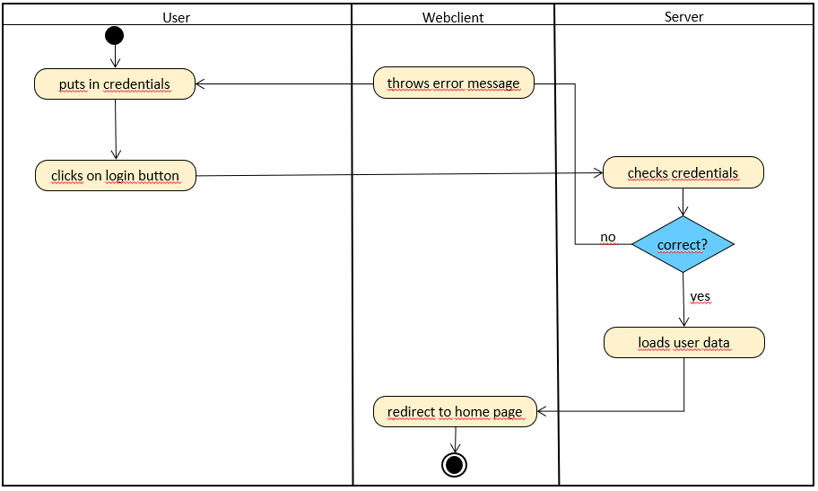
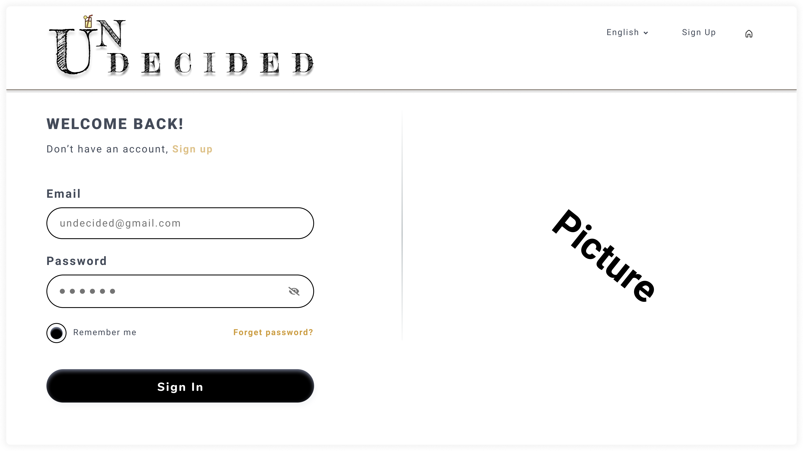

# 1 Login
[Login](https://github.com/2002chris/UNDECIDED_DOCS/blob/master/docs/SRS/SRS.md#312-login)

## 1.1 Brief Description
A user is able to log into his/her account.
# 2 Flow of Events
## 2.1 Basic Flow

- User puts in login credentials
- User clicks on "login" button
- User gets logged in to the home page of his/her account
    
### 2.1.1 Activity Diagram

### 2.1.2 Mock-up

### 2.1.3 Narrative

## 2.2 Alternative Flows
### Wrong login credentials

- User accidentally puts in wrong credentials
- User clicks on "login" button
- Error message is shown on the login page
- User has to start logging in again

# 3 Special Requirements
(n/a)

# 4 Preconditions
(n/a)

# 5 Postconditions
(n/a)

# 6 Extension Points
(n/a)
