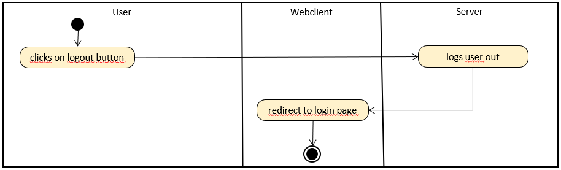

# 1 Logout
[Login](https://github.com/2002chris/UNDECIDED_DOCS/blob/master/docs/SRS/SRS.md#314-logout)

## 1.1 Brief Description
A user is able to log out from his/her account.
# 2 Flow of Events
## 2.1 Basic Flow

- User clicks on "logout" button
- User gets logged out from the home page of his/her account
    
### 2.1.1 Activity Diagram

### 2.1.2 Mock-up

### 2.1.3 Narrative

## 2.2 Alternative Flows

# 3 Special Requirements
(n/a)

# 4 Preconditions
(n/a)

# 5 Postconditions
(n/a)

# 6 Extension Points
(n/a)
